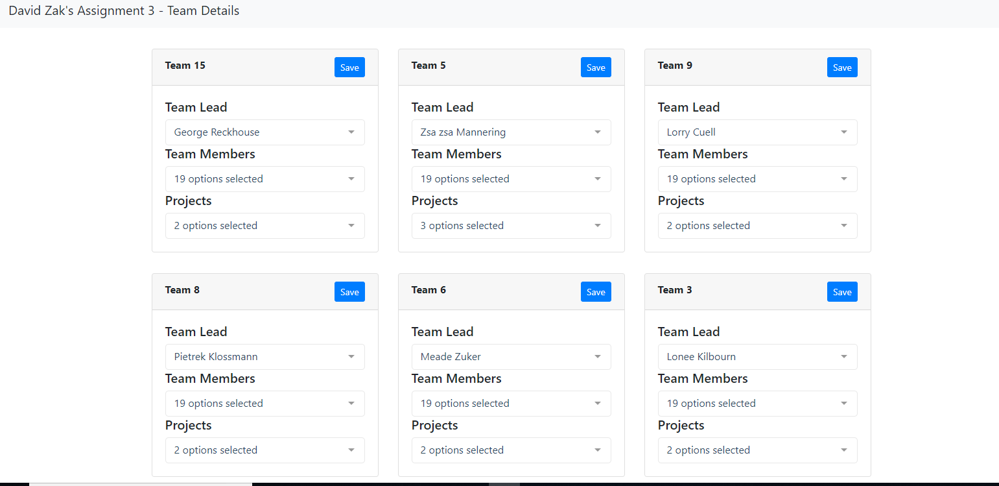

# vue-teams-app
vue project for web422 to display teams data
data is fetched from api hosted on heroku

# how to run
before running do a  
```
npm install
```

to run use 
```
parcel index.html
```

#Screenshots



